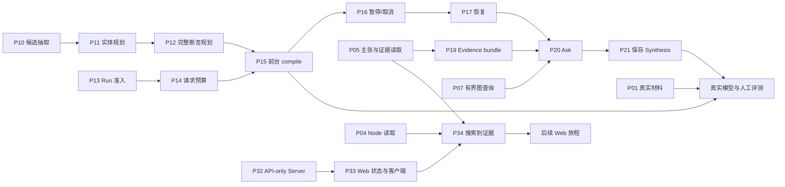

# KnowMesh v0.1 执行票

> Status: Single-agent continuous execution。任务验收与 86 条原生依赖保留；实时完成状态以 GitHub 为准。
> [发布映射](publication.json)记录全部编号；[单 agent 启动入口](../../agents/START.md)说明持续执行。
> 代码基线：`5247efe`；旧 issue 状态快照：2026-09-07。
> [执行规格](spec.md)说明取舍；[执行循环](../../agents/worker-start.md)说明连续开发。

## 已批准范围

本目录保留 56 张执行票及其验收、原始需求映射和阻塞关系。历史难度仅为工作量提示，不再对应多个 agent 或工作目录。P 编号保持稳定，实时状态以 GitHub 为准。

任务粒度、真实前置依赖和 CLI/Core + 真实 SQLite/临时 workspace 的验收方式已批准。Core-only 规划与预算阶段先通过最高 Core 集成接口验收，公开命令由后续执行器票负责。具体边界在每票内写明。

同一 agent 一次实现一张已就绪票，完成验证、提交和状态更新后自动继续。已关闭且代码已合入的票不重复执行。

## 持续执行

先恢复未完成的实现、修复或 CI，再按[执行规格](spec.md#execution-order)选择下一张已解除阻塞的票。没有 per-issue worktree、新会话或协调者派发要求。某票外部阻塞时记录原因并继续其他任务；只有全部授权工作完成、用户暂停或所有剩余任务都外部阻塞时结束。

## 关键依赖

下图展示功能依赖，不表示多个 agent 并行执行；实际依赖与状态以 GitHub 为准。

## 完整拆分

P 编号标识任务，不表示执行顺序；例如 P54 的最终验收等待后补明确的 P55/P56。单 agent 按实际阻塞关系选择执行顺序。

1. **[P01 / #47 真实材料溯源清单与导入检索基线](https://github.com/CaiZongyuan/knowmesh/issues/47)**（简单）。Blocked by：无，批准并建立共享基线后可开始。
   交付：为 Virtual Cell dogfooding 建立可追溯的真实材料清单，用当前已实现的导入、同步与词法检索能力复现最小研究资料库。

2. **[P02 / #48 Proposal 列表与稳定分页](https://github.com/CaiZongyuan/knowmesh/issues/48)**（中）。Blocked by：无，批准并建立共享基线后可开始。
   交付：用户通过 `proposal list` 找到待审或历史 Proposal，取得有界摘要并继续分页；结果来自一致的 runtime 快照，随后可使用已有详情和审核操作。

3. **[P03 / #49 Relaxed accept-all 与 Apply 组合操作](https://github.com/CaiZongyuan/knowmesh/issues/49)**（中）。Blocked by：无，批准并建立共享基线后可开始。
   交付：在 workspace policy 允许时，用户可用显式确认的组合入口接受尚未决定的 Proposal items 并 Apply。

4. **[P04 / #50 Node get/list 与 Schema entity discovery](https://github.com/CaiZongyuan/knowmesh/issues/50)**（中）。Blocked by：无，批准并建立共享基线后可开始。
   交付：用户和 Agent 可按 Node ID 或名称查看知识节点，按类型等声明筛选分页浏览，并通过 `schema entity` 取得其类型、属性约束与展示 metadata。

5. **[P05 / #51 Claim、Relation 与 Evidence 读取闭环](https://github.com/CaiZongyuan/knowmesh/issues/51)**（中）。Blocked by：无，批准并建立共享基线后可开始。
   交付：从 Search hit、Node 或 Relation ID 出发，用户可读取主张和关系、列出其证据，再取得原始 quote、locator 和不可变 Source Revision 身份。

6. **[P06 / #52 Synthesis get/list 与派生 freshness](https://github.com/CaiZongyuan/knowmesh/issues/52)**（简单）。Blocked by：无，批准并建立共享基线后可开始。
   交付：用户可列出和读取现有规范 Synthesis，包括正文、引用及生成时依赖快照，并识别来源或主张变化后的复核需求。

7. **[P07 / #53 有界 Graph neighbors 与 subgraph](https://github.com/CaiZongyuan/knowmesh/issues/53)**（中）。Blocked by：无，批准并建立共享基线后可开始。
   交付：用户从指定 Node 或受限 roots 集合查询局部图，明确区分 accepted typed Relations 与弱 mentions，结果包含完整的查询限制与可见截断信息。

8. **[P08 / #54 可取证 Graph path 与 node.related](https://github.com/CaiZongyuan/knowmesh/issues/54)**（中）。Blocked by：[P07](tickets/P07.md)。
   交付：用户查询两节点间有界最短路径，并从 `node.related` 取得由已记录图关系解释的邻近节点；每条知识路径可以继续按 Relation ID 取证。

9. **[P09 / #55 Source Chunk 检索投影与重建再生](https://github.com/CaiZongyuan/knowmesh/issues/55)**（中）。Blocked by：无，批准并建立共享基线后可开始。
   交付：导入来源并同步后，即使尚未形成 accepted assertions，用户也能通过已有 Search 找到可解析的原始 Chunk。

10. **[P10 / #56 可缓存的 Compiler 候选抽取](https://github.com/CaiZongyuan/knowmesh/issues/56)**（难）。Blocked by：无，批准并建立共享基线后可开始。
   交付：固定 Source Revision 经现有 parse/chunk 与受 Schema 约束的模型调用后，产生可验证、可缓存的候选实体、主张、关系和 warnings。

11. **[P11 / #57 Entities 模式生成可审核 Proposal 规划](https://github.com/CaiZongyuan/knowmesh/issues/57)**（难）。Blocked by：[P10](tickets/P10.md)。
   交付：从 P10 的来源候选出发，Compiler 核对实体 mentions，解析现有实体身份，并把新实体、alias/mention 等允许变化交给既有 Builder 形成可审核的 entities-mode Proposal 规划。

12. **[P12 / #58 Assertions 与 full 模式的完整 Proposal 规划](https://github.com/CaiZongyuan/knowmesh/issues/58)**（难）。Blocked by：[P11](tickets/P11.md)。
   交付：Compiler 将已解析实体上的 Claim/Relation 候选、逐字证据、去重和冲突结果组合为 assertions/full Proposal。

13. **[P13 / #59 持久 Run 准入、幂等绑定与 get/list](https://github.com/CaiZongyuan/knowmesh/issues/59)**（中）。Blocked by：无，批准并建立共享基线后可开始。
   交付：Core 在任何模型调用前持久化一个可重放任务，并把幂等 key 绑定到同一 Run。

14. **[P14 / #60 逐模型请求的持久预算、重试与控制接入](https://github.com/CaiZongyuan/knowmesh/issues/60)**（难）。Blocked by：[P13](tickets/P13.md)。
   交付：每个实际发出的模型请求，包括 retry 和 structured-output repair，都在持久 Run 预算内先预留再结算，并可在调用期间观察停止信号。

15. **[P15 / #61 前台 compile、checkpoint 与原子 Proposal 发布](https://github.com/CaiZongyuan/knowmesh/issues/61)**（难）。Blocked by：[P12](tickets/P12.md)、[P14](tickets/P14.md)。
   交付：用户执行 `compile source`，得到持久 Run 和一份待审核 Proposal。

16. **[P16 / #62 Run pause/cancel 与 CLI Ctrl-C](https://github.com/CaiZongyuan/knowmesh/issues/62)**（难）。Blocked by：[P15](tickets/P15.md)。
   交付：用户在另一个 CLI 中暂停或取消正在编译的 Run，也可用 Ctrl-C 停止前台执行。

17. **[P17 / #63 显式 Run resume 与崩溃、迟到结果恢复](https://github.com/CaiZongyuan/knowmesh/issues/63)**（难）。Blocked by：[P16](tickets/P16.md)。
   交付：用户显式 `run resume`，在同一 Run 身份上从最近完整且依赖仍有效的 checkpoint 继续。

18. **[P18 / #64 Source refresh 生成显式复核 Proposal](https://github.com/CaiZongyuan/knowmesh/issues/64)**（难）。Blocked by：[P17](tickets/P17.md)。
   交付：用户对新版来源执行 `compile source --mode refresh`，比较该来源历史 Evidence 关联的 accepted assertions，得到追加证据、替代或冲突的显式 Proposal 与无法对应的复核 warnings。

19. **[P19 / #65 确定性 Evidence bundle 与可见省略清单](https://github.com/CaiZongyuan/knowmesh/issues/65)**（难）。Blocked by：[P05](tickets/P05.md)。
   交付：Core 从实际过滤后的检索命中构建模型将看到的 Evidence bundle，保留完整 quote、冲突双方和来源/预算限制。

20. **[P20 / #66 持久且有证据约束的 Ask](https://github.com/CaiZongyuan/knowmesh/issues/66)**（难）。Blocked by：[P19](tickets/P19.md)、[P17](tickets/P17.md)、[P07](tickets/P07.md)。
   交付：用户运行 `ask`，得到由本次 Evidence bundle 支持的 Answer、citations、conflicts、gaps 和相关知识图。

21. **[P21 / #67 原始 Ask 快照到 Synthesis Proposal 保存闭环](https://github.com/CaiZongyuan/knowmesh/issues/67)**（中）。Blocked by：[P20](tickets/P20.md)。
   交付：用户选择已有 Ask Run 创建 Synthesis Proposal，经现有 review/apply 保存为规范 Markdown；生成时真正使用的依赖快照随之固定，之后可以再次检索并识别变化。

22. **[P22 / #68 Embedding provider 与按输入复用的缓存](https://github.com/CaiZongyuan/knowmesh/issues/68)**（难）。Blocked by：无，批准并建立共享基线后可开始。
   交付：Core 对明确的实际文本输入调用配置的 embedding provider，取得受验证的向量并复用完整缓存。

23. **[P23 / #69 Optional sqlite-vec 与过滤后的 RRF 检索](https://github.com/CaiZongyuan/knowmesh/issues/69)**（难）。Blocked by：[P22](tickets/P22.md)、[P09](tickets/P09.md)。
   交付：用户启用 embedding 时，已有 Search 在 lexical 之外使用 sqlite-vec 通道；没有 extension/key/provider 时仍能搜索并明确披露降级。

24. **[P24 / #70 CLI 列表格式与 NDJSON 输出契约](https://github.com/CaiZongyuan/knowmesh/issues/70)**（中）。Blocked by：无，批准并建立共享基线后可开始。
   交付：用户对适用的列表结果选择 table/csv，对已声明的流式或批量结果选择 ndjson；默认 JSON 和 pretty 保持已有 envelope 契约，机器读取不会混入日志或交互问题。

25. **[P25 / #71 CLI 日志、全局 timeout、trace 与 no-color](https://github.com/CaiZongyuan/knowmesh/issues/71)**（中）。Blocked by：无，批准并建立共享基线后可开始。
   交付：用户可设置日志等级、全局执行 timeout、trace ID 和禁用颜色。

26. **[P26 / #72 显式 canonical migrate 预览、备份与版本拒绝](https://github.com/CaiZongyuan/knowmesh/issues/72)**（难）。Blocked by：无，批准并建立共享基线后可开始。
   交付：用户通过显式 `migrate --to` 预览规范格式迁移；受支持的变更在执行前备份，随后走可恢复 canonical transaction。

27. **[P27 / #73 真实进程退出恢复矩阵与 Doctor locator 检查](https://github.com/CaiZongyuan/knowmesh/issues/73)**（难）。Blocked by：无，批准并建立共享基线后可开始。
   交付：用真实子进程退出验证已有 canonical transaction 的持久性，并让 Doctor 对 Evidence 的实际来源 bytes/quote/locator 给出诊断。

28. **[P28 / #74 内嵌 Skill 资源清单与读取导出](https://github.com/CaiZongyuan/knowmesh/issues/74)**（中）。Blocked by：无，批准并建立共享基线后可开始。
   交付：让用户仅凭后端 binary 就能发现、读取并导出与该版本一致的 Skill 及其引用资源。

29. **[P29 / #75 三类 Harness 的薄 Loader 安装器](https://github.com/CaiZongyuan/knowmesh/issues/75)**（中）。Blocked by：[P28](tickets/P28.md)。
   交付：为 Claude Code、Codex 和 generic 提供可预览、可重复执行的 Loader 安装流程。

30. **[P30 / #76 六个完整版本化 Skills 与可执行示例](https://github.com/CaiZongyuan/knowmesh/issues/76)**（简单）。Blocked by：[P28](tickets/P28.md)、[P08](tickets/P08.md)、[P15](tickets/P15.md)、[P21](tickets/P21.md)、[P26](tickets/P26.md)、[P04](tickets/P04.md)。
   交付：以已交付命令为依据，完成 shared、search、research、ingest、graph、maintain 六个内嵌 Skills。

31. **[P31 / #77 全新上下文 Harness 读写 smoke 验证](https://github.com/CaiZongyuan/knowmesh/issues/77)**（中）。Blocked by：[P29](tickets/P29.md)、[P30](tickets/P30.md)、[P17](tickets/P17.md)。
   交付：在 Claude Code、Codex 与 generic shell Agent 的全新上下文中验证仅靠 Loader 和后端 CLI 能完成证据检索与受控写入。

32. **[P32 / #78 启动具备安全边界的 API-only Server](https://github.com/CaiZongyuan/knowmesh/issues/78)**（难）。Blocked by：无，批准并建立共享基线后可开始。
   交付：用户仅安装后端即可启动 HTTP 服务，查看存活状态、workspace 状态和 API 能力。

33. **[P33 / #79 交付独立 Web 状态页与兼容性握手](https://github.com/CaiZongyuan/knowmesh/issues/79)**（中）。Blocked by：[P32](tickets/P32.md)。
   交付：建立独立构建的 Web 客户端，首屏实际连接后端并显示 workspace 状态。

34. **[P34 / #80 贯通搜索到知识与原始证据的浏览流程](https://github.com/CaiZongyuan/knowmesh/issues/80)**（中）。Blocked by：[P33](tickets/P33.md)、[P04](tickets/P04.md)、[P05](tickets/P05.md)。
   交付：用户在 Web 搜索现有知识，打开 Node、Claim 或 Relation，并检查其引用 Evidence 的原始 quote、来源 revision 与 locator。

35. **[P35 / #81 浏览来源历史内容与分页影响清单](https://github.com/CaiZongyuan/knowmesh/issues/81)**（中）。Blocked by：[P33](tickets/P33.md)、[P09](tickets/P09.md)。
   交付：用户通过 Web 查阅来源 metadata、全部 revision、解析内容和更新影响，按页或章节定位当前及历史证据。

36. **[P36 / #82 补齐来源规范写入的持久幂等结果](https://github.com/CaiZongyuan/knowmesh/issues/82)**（难）。Blocked by：无，批准并建立共享基线后可开始。
   交付：用户为 source add/remove 指定幂等键后，即使响应丢失、进程中断或再次调用，也能获得同一次已提交来源操作的结果。

37. **[P37 / #84 从 Web 安全添加和移除来源](https://github.com/CaiZongyuan/knowmesh/issues/84)**（中）。Blocked by：[P35](tickets/P35.md)、[P36](tickets/P36.md)、[P55](tickets/P55.md)。
   交付：用户通过文件上传或单页 URL 添加来源、为既有来源追加 revision，并预览和确认 soft-remove。

38. **[P38 / #85 在 Web 审核并应用 Proposal](https://github.com/CaiZongyuan/knowmesh/issues/85)**（难）。Blocked by：[P02](tickets/P02.md)、[P03](tickets/P03.md)、[P34](tickets/P34.md)、[P35](tickets/P35.md)。
   交付：用户从 Proposal 队列打开结构化 diff，核对 Schema 与原始 Evidence，逐项编辑、接受或拒绝，最后按策略预览并确认 Apply。

39. **[P39 / #86 浏览局部图谱、路径与边证据](https://github.com/CaiZongyuan/knowmesh/issues/86)**（中）。Blocked by：[P08](tickets/P08.md)、[P34](tickets/P34.md)。
   交付：用户围绕指定 Node 查看有界局部图，筛选关系并寻找路径，再从节点或边进入知识与 Evidence Inspector。

40. **[P40 / #87 稳定执行图谱增量展开与 Worker 布局](https://github.com/CaiZongyuan/knowmesh/issues/87)**（难）。Blocked by：[P39](tickets/P39.md)。
   交付：用户连续展开局部图时保留已有位置和观察方向，新增节点在 Worker 中布局。

41. **[P41 / #88 通过 HTTP 接纳并控制可恢复编译任务](https://github.com/CaiZongyuan/knowmesh/issues/88)**（难）。Blocked by：[P17](tickets/P17.md)、[P32](tickets/P32.md)。
   交付：调用方通过 HTTP 提交编译后立即获得已接纳的 Run，随后读取进度、控制暂停或取消，并显式恢复原任务。

42. **[P42 / #89 在来源页面编译并恢复同一 Run](https://github.com/CaiZongyuan/knowmesh/issues/89)**（中）。Blocked by：[P41](tickets/P41.md)、[P35](tickets/P35.md)、[P37](tickets/P37.md)。
   交付：用户在来源页选择可编译 revision，提交编译后观察阶段、累计预算和结果，并暂停、取消或恢复同一 Run。

43. **[P43 / #90 从 Web 提问并审核保存 Synthesis](https://github.com/CaiZongyuan/knowmesh/issues/90)**（中）。Blocked by：[P21](tickets/P21.md)、[P38](tickets/P38.md)、[P39](tickets/P39.md)、[P41](tickets/P41.md)、[P06](tickets/P06.md)。
   交付：用户在工作区 Ask 栏提交研究问题，查看可追溯回答及冲突、知识缺口，并将该 Run 的结果保存为待审核 Synthesis Proposal。

44. **[P44 / #91 只读查看设置、Schema、模型能力与诊断](https://github.com/CaiZongyuan/knowmesh/issues/91)**（中）。Blocked by：[P33](tickets/P33.md)。
   交付：补齐 SPEC 已列出的设置与诊断路由：用户只读查看 workspace 配置摘要、Schema Pack、模型 profile/能力及现有 doctor 诊断。

45. **[P45 / #92 同步外部编辑并安全切换 Server 索引连接](https://github.com/CaiZongyuan/knowmesh/issues/92)**（难）。Blocked by：[P32](tickets/P32.md)。
   交付：Server 运行期间，用户外部编辑规范文件后可从后续 API 读取看到同步结果；执行已有 rebuild 时，Server 协调读取连接排空、索引替换和重新打开。

46. **[P46 / #93 安全托管独立 Web 资源并验证兼容性](https://github.com/CaiZongyuan/knowmesh/issues/93)**（难）。Blocked by：[P32](tickets/P32.md)。
   交付：用户显式指定已下载的外部 Web 目录后，Server 验证资源结构与 API 兼容性并提供同源静态页面。

47. **[P47 / #94 原生后端压缩包校验值与安装器](https://github.com/CaiZongyuan/knowmesh/issues/94)**（难）。Blocked by：[P28](tickets/P28.md)。
   交付：构建五个目标平台的独立后端候选压缩包、checksums 和 Shell/PowerShell 安装器。

48. **[P48 / #95 npm 后端下载器与透明命令启动器](https://github.com/CaiZongyuan/knowmesh/issues/95)**（中）。Blocked by：[P47](tickets/P47.md)。
   交付：把现有 npm 初始化占位包升级为可测试的后端安装渠道，按平台下载同版本原生 artifact 并透传 CLI 进程行为。

49. **[P49 / #96 独立 Web 静态包与兼容性 manifest](https://github.com/CaiZongyuan/knowmesh/issues/96)**（中）。Blocked by：[P33](tickets/P33.md)、[P46](tickets/P46.md)。
   交付：将现有 Web 客户端独立构建为可下载解压的静态压缩包，携带版本、API 兼容范围、必需能力声明与 checksums。

50. **[P50 / #97 独立发布工作流与兼容性 fixture 矩阵](https://github.com/CaiZongyuan/knowmesh/issues/97)**（难）。Blocked by：[P48](tickets/P48.md)、[P49](tickets/P49.md)。
   交付：建立分别面向 cli-v* 与 web-v* 的发布工作流及兼容性 fixture 矩阵，先以 dry-run 和候选 artifact 验证构建、校验、包边界与发布顺序。

51. **[P51 / #98 人工 gold 支持的真实 Compiler 评测](https://github.com/CaiZongyuan/knowmesh/issues/98)**（中）。Blocked by：[P01](tickets/P01.md)、[P15](tickets/P15.md)。
   交付：基于溯源清单中的真实论文材料运行完整 Compiler，用至少 20 个经过人工审核的片段衡量抽取、定位、实体解析和冲突检测。

52. **[P52 / #99 检索相关性与公开容量性能评测](https://github.com/CaiZongyuan/knowmesh/issues/99)**（中）。Blocked by：[P01](tickets/P01.md)、[P23](tickets/P23.md)、[P08](tickets/P08.md)、[P04](tickets/P04.md)。
   交付：在可追溯研究材料与明确标识的容量 fixture 上比较 word、trigram、vector、hybrid 检索质量，并测量公共 CLI、Graph 和同步性能。

53. **[P53 / #100 十个真实问题的人工 Answer 与刷新评测](https://github.com/CaiZongyuan/knowmesh/issues/100)**（中）。Blocked by：[P01](tickets/P01.md)、[P21](tickets/P21.md)、[P18](tickets/P18.md)。
   交付：用至少 10 个真实 Virtual Cell 研究问题完成 Ask、Synthesis 保存与来源刷新 dogfooding。

54. **[P54 / #102 Release candidate 完整性与独立安装验收](https://github.com/CaiZongyuan/knowmesh/issues/102)**（难）。Blocked by：[P24](tickets/P24.md)、[P25](tickets/P25.md)、[P26](tickets/P26.md)、[P27](tickets/P27.md)、[P31](tickets/P31.md)、[P40](tickets/P40.md)、[P42](tickets/P42.md)、[P43](tickets/P43.md)、[P44](tickets/P44.md)、[P45](tickets/P45.md)、[P50](tickets/P50.md)、[P51](tickets/P51.md)、[P52](tickets/P52.md)、[P53](tickets/P53.md)、[P55](tickets/P55.md)、[P56](tickets/P56.md)。
   交付：对固定版本的最终后端、npm 与 Web 候选产物完成 v0.1 完整性、独立安装和兼容性验收，形成可以直接审查的 release candidate 报告。

55. **[P55 / #83 Sync、Doctor repair 与 Rebuild 的显式键重放](https://github.com/CaiZongyuan/knowmesh/issues/83)**（难）。Blocked by：无，批准并建立共享基线后可开始。
   交付：用户为 sync、doctor --repair 或 rebuild 指定显式幂等键后，即使响应丢失、再次执行或中途退出，也能取得同一次已提交维护操作的原始结果。

56. **[P56 / #101 初始化前后均可恢复的显式键回执](https://github.com/CaiZongyuan/knowmesh/issues/101)**（难）。Blocked by：无，批准并建立共享基线后可开始。
   交付：用户为 init 指定显式幂等键，首次执行便固定目标和 workspace 身份；即使配置尚未写出、SQLite 尚不存在或成功响应丢失，后续重试仍能恢复并返回原初始化结果。

## 原 Issue 映射

旧票保留历史，按用户授权补充新的执行映射并标记 tracking-only，不因新拆分而关闭。下面列出全部 25 个未关闭实施票的剩余工作归属；原 [#1](https://github.com/CaiZongyuan/knowmesh/issues/1)仍是最终发布 tracker，P54 汇总验收但不自动关闭它。

| 原 Issue | 新执行范围 |
| --- | --- |
| [#2 初始化 Rust/React monorepo](https://github.com/CaiZongyuan/knowmesh/issues/2) | [P33](tickets/P33.md) |
| [#10 实现 Synthesis parser/writer](https://github.com/CaiZongyuan/knowmesh/issues/10) | [P21](tickets/P21.md) |
| [#13 实现 fast sync 与 file watcher](https://github.com/CaiZongyuan/knowmesh/issues/13) | [P45](tickets/P45.md) |
| [#14 实现 atomic rebuild 与 doctor](https://github.com/CaiZongyuan/knowmesh/issues/14) | [P27](tickets/P27.md)、[P45](tickets/P45.md)、[P55](tickets/P55.md) |
| [#18 集成 sqlite-vec optional capability](https://github.com/CaiZongyuan/knowmesh/issues/18) | [P22](tickets/P22.md)、[P23](tickets/P23.md) |
| [#19 实现 Graph neighbors/path/subgraph](https://github.com/CaiZongyuan/knowmesh/issues/19) | [P07](tickets/P07.md)、[P08](tickets/P08.md) |
| [#27 实现 Proposal builder/review/apply](https://github.com/CaiZongyuan/knowmesh/issues/27) | [P02](tickets/P02.md)、[P03](tickets/P03.md) |
| [#28 实现可恢复 Run 与执行控制](https://github.com/CaiZongyuan/knowmesh/issues/28) | [P10](tickets/P10.md)、[P11](tickets/P11.md)、[P12](tickets/P12.md)、[P13](tickets/P13.md)、[P14](tickets/P14.md)、[P15](tickets/P15.md)、[P16](tickets/P16.md)、[P17](tickets/P17.md)、[P41](tickets/P41.md) |
| [#29 实现 source refresh Proposal](https://github.com/CaiZongyuan/knowmesh/issues/29) | [P18](tickets/P18.md) |
| [#30 实现 CLI global contract](https://github.com/CaiZongyuan/knowmesh/issues/30) | [P24](tickets/P24.md)、[P25](tickets/P25.md)、[P36](tickets/P36.md)、[P55](tickets/P55.md)、[P56](tickets/P56.md) |
| [#31 实现完整 v0.1 command tree](https://github.com/CaiZongyuan/knowmesh/issues/31) | [P02](tickets/P02.md)、[P04](tickets/P04.md)、[P05](tickets/P05.md)、[P06](tickets/P06.md)、[P08](tickets/P08.md)、[P09](tickets/P09.md)、[P15](tickets/P15.md)、[P26](tickets/P26.md)、[P36](tickets/P36.md)、[P54](tickets/P54.md)、[P55](tickets/P55.md)、[P56](tickets/P56.md) |
| [#32 实现 embedded Skills 与 Loader installer](https://github.com/CaiZongyuan/knowmesh/issues/32) | [P28](tickets/P28.md)、[P29](tickets/P29.md)、[P30](tickets/P30.md) |
| [#33 Agent Harness smoke eval](https://github.com/CaiZongyuan/knowmesh/issues/33) | [P31](tickets/P31.md) |
| [#34 实现 Axum `/api/v1` 与 OpenAPI](https://github.com/CaiZongyuan/knowmesh/issues/34) | [P32](tickets/P32.md)、[P34](tickets/P34.md)、[P35](tickets/P35.md)、[P37](tickets/P37.md)、[P38](tickets/P38.md)、[P39](tickets/P39.md)、[P41](tickets/P41.md)、[P43](tickets/P43.md)、[P44](tickets/P44.md) |
| [#35 生成 TS/Zod/TanStack Query client](https://github.com/CaiZongyuan/knowmesh/issues/35) | [P33](tickets/P33.md) |
| [#36 实现 App Shell 与路由](https://github.com/CaiZongyuan/knowmesh/issues/36) | [P33](tickets/P33.md)、[P43](tickets/P43.md)、[P44](tickets/P44.md) |
| [#37 实现 Source/Wiki/Search 页面](https://github.com/CaiZongyuan/knowmesh/issues/37) | [P34](tickets/P34.md)、[P35](tickets/P35.md)、[P37](tickets/P37.md)、[P42](tickets/P42.md) |
| [#38 实现 Sigma/Graphology 图谱页](https://github.com/CaiZongyuan/knowmesh/issues/38) | [P39](tickets/P39.md)、[P40](tickets/P40.md) |
| [#39 实现 Proposal Review UI](https://github.com/CaiZongyuan/knowmesh/issues/39) | [P38](tickets/P38.md) |
| [#40 实现 evidence bundle 与 Ask synthesizer](https://github.com/CaiZongyuan/knowmesh/issues/40) | [P19](tickets/P19.md)、[P20](tickets/P20.md)、[P43](tickets/P43.md) |
| [#41 实现 Synthesis Proposal/save loop](https://github.com/CaiZongyuan/knowmesh/issues/41) | [P21](tickets/P21.md)、[P43](tickets/P43.md) |
| [#42 建立 Virtual Cell dogfooding workspace/evals](https://github.com/CaiZongyuan/knowmesh/issues/42) | [P01](tickets/P01.md)、[P09](tickets/P09.md)、[P51](tickets/P51.md)、[P52](tickets/P52.md)、[P53](tickets/P53.md) |
| [#43 发布独立后端 CLI/Core 与安装文档](https://github.com/CaiZongyuan/knowmesh/issues/43) | [P47](tickets/P47.md)、[P48](tickets/P48.md)、[P54](tickets/P54.md) |
| [#44 发布独立 Web 包并支持外部静态资源](https://github.com/CaiZongyuan/knowmesh/issues/44) | [P46](tickets/P46.md)、[P49](tickets/P49.md)、[P54](tickets/P54.md) |
| [#45 实现独立发布流水线与兼容性验收](https://github.com/CaiZongyuan/knowmesh/issues/45) | [P50](tickets/P50.md)、[P54](tickets/P54.md) |

已关闭的 19 个组件继续作为基线：[#3](https://github.com/CaiZongyuan/knowmesh/issues/3)、[#4](https://github.com/CaiZongyuan/knowmesh/issues/4)、[#5](https://github.com/CaiZongyuan/knowmesh/issues/5)、[#6](https://github.com/CaiZongyuan/knowmesh/issues/6)、[#7](https://github.com/CaiZongyuan/knowmesh/issues/7)、[#8](https://github.com/CaiZongyuan/knowmesh/issues/8)、[#9](https://github.com/CaiZongyuan/knowmesh/issues/9)、[#11](https://github.com/CaiZongyuan/knowmesh/issues/11)、[#12](https://github.com/CaiZongyuan/knowmesh/issues/12)、[#15](https://github.com/CaiZongyuan/knowmesh/issues/15)、[#16](https://github.com/CaiZongyuan/knowmesh/issues/16)、[#17](https://github.com/CaiZongyuan/knowmesh/issues/17)、[#20](https://github.com/CaiZongyuan/knowmesh/issues/20)、[#21](https://github.com/CaiZongyuan/knowmesh/issues/21)、[#22](https://github.com/CaiZongyuan/knowmesh/issues/22)、[#23](https://github.com/CaiZongyuan/knowmesh/issues/23)、[#24](https://github.com/CaiZongyuan/knowmesh/issues/24)、[#25](https://github.com/CaiZongyuan/knowmesh/issues/25)、[#26](https://github.com/CaiZongyuan/knowmesh/issues/26)。P36 对 #8、P09 对 #22、P56 对 #6 的引用表示复用已完成组件并补上更大工作流的剩余契约，不表示重开或重复实现这些票。Proposal 幂等已在 `5247efe` 完成；#27 剩余的公共便捷能力由 P02/P03 拥有，HTTP 由 P38 拥有。

## HTTP 与页面归属

| 契约/用户旅程 | 执行票 |
| --- | --- |
| health、capabilities、status、基础 OpenAPI、安全与路由登记 | P32 |
| 独立 Web 工程、首次生成客户端、状态/连接界面 | P33 |
| search、node、claim、relation、evidence、schema.entity 与知识浏览 | P34 |
| source list/get/content、固定 revision 内容、impact 与来源浏览 | P35 |
| Source 写入显式幂等；维护 sync 键；随后 HTTP upload/URL/remove/sync | P36；P55；P37 |
| proposal list/get/create/edit/review/revalidate/reject/apply、schema.patch 与审核 | P38 |
| graph neighbors/path/subgraph、路径/Inspector/列表替代 | P39；增量布局 P40 |
| compile、run get/list/pause/cancel/resume HTTP；来源执行 UI | P41；P42 |
| ask、synthesis propose/list/get HTTP 与回答/保存 | P43 |
| settings.get、doctor、schema.pack/schema.command 与只读设置 | P44 |
| Server watcher、重建连接排空与重开 | P45 |
| 外部静态资源、manifest、兼容性与缓存 | P46 |

基础 HTTP 不提前承诺后续业务路由可用。新增路由由同一 agent 在所属票中同步 OpenAPI 和生成客户端。P38 不包含自由创建编辑器，但包含既有 proposal.create 的 HTTP 契约。

## 发布与验收

前置的 P47-P50 验证候选产物和工作流，不要求先完成所有产品功能，也不发布正式版本。P54 等待完整依赖闭包，并用最终集成提交重新生成候选产物验证原 SPEC 第 25 节。

P01 的标注只是候选。P51/P52/P53 开始正式质量评分前，必须取得适用的人工 gold、相关性判断或事实支持评审；若没有，准备脚本和材料仍可推进，质量 gate 保持未验证。记录人工签署与具体材料版本，不把 agent 自评当人工结论。

执行票已发布，本目录保留出版快照。单 agent 依据线上依赖和状态持续实现、验证、提交及更新结果。完成一票后自动选择下一票，不以 PR 或提交作为停止点。
